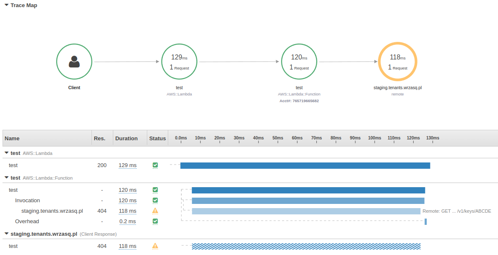

<!---
# This file is part of the pl.wrzasq.commons.
#
# @license http://mit-license.org/ The MIT license
# @copyright 2022 © by Rafał Wrzeszcz - Wrzasq.pl.
-->

# Ktor feature

`XRayFeature` integrates [**AWS X-Ray**](https://aws.amazon.com/xray/) tracing for HTTP clients.

```kotlin
val httpClient = HttpClient(engine) {
    install(XRayFeature)
}
```

It resembles behavior of `aws-xray-recorder-sdk-apache-http`.


